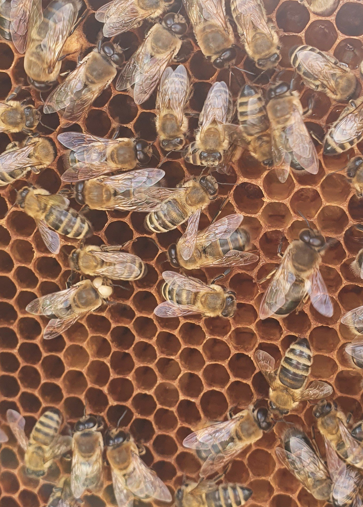

# Attention center

This repository contains
 - a [TensorFlow Lite](https://www.tensorflow.org/lite) model to that can be used to predict the attention center of an image, i.e. the area where the most salient parts of an image lie.
 - a python script that can be used to batch encode images using the attention centers. This can be used with the submodule [libjxl](firschinghttps://github.com/libjxl/libjxl) in order to create JPEG XL images such that decoding the image will start from the attention center determined by the model.

 [Using Saliency in progressive JPEG XL images](https://opensource.googleblog.com/2021/09/using-saliency-in-progressive-jpeg-xl-images.html) is a blog post about this open source project.

 For the training of the model [center.tflite](./model/center.tflite) has been trained with images from the [Common objects in context](https://cocodataset.org/#home) annotated with saliency from the [salicon dataset](http://salicon.net/).

## How to use

Make sure you have python and tensorflow installed.

1. Clone it from GitHub including the submodules
2. Build libjxl, for example by following the [instructions](https://github.com/libjxl/libjxl/blob/main/README.md) given in the the [libjxl repo](https://github.com/libjxl/libjxl).
3. run the `encode_with_centers.py` script.

Here `${INPUT_IMAGE_DIR}` contains images that can be opened with the [Python Imaging Library](https://github.com/python-pillow/Pillow) and `${OUTPUT_IMAGE_DIR}` will be created if it does not exist and the encoded JPEG_XL images will be placed there.

``` shell
git clone https://github.com/google/attention-center --recursive --shallow-submodules
cd attention-center/libjxl
mkdir build
cd build
cmake -DCMAKE_BUILD_TYPE=Release -DBUILD_TESTING=OFF ..
cmake --build . -- -j$(nproc)
cd ../../
python encode_with_centers.py --lite_model_file=./model/center.tflite \
  --image_dir="${INPUT_IMAGE_DIR}" --output_dir="${OUTPUT_IMAGE_DIR}"
```

There are the following flags:
```
  --[no]dry_run: If true, only do a dry run, do not write files.
    (default: 'false')
  --encoder: Location of th encoder binary.
    (default: './libjxl/build/tools/cjxl_ng')
  --image_dir: Name of the directory of input images.
  --lite_model_file: Path to the corresponding TFLite model.
  --new_suffix: File extension of the compressed file.
    (default: 'jxl')
  --output_dir: Name of the directory of the output images.
  --[no]verbose: If true, prints info about the commands executed.
    (default: 'true')
  ```

An example for using `--` would be
```shell
python encode_with_centers.py --lite_model_file=./model/center.tflite   --image_dir=/tmp/images --output_dir=/tmp/out/ -- -distance 1.1
```
Here we pass the flag `--distance 1.1` to `cjxl_ng`.

The flags and arguments for `--center_x`, `--center_y` and `--group_order` are automatically injected.

## Example attention center calculations

Here we show an example image, where the calculated attention center of an
image is computed. Running

```shell
python encode_with_centers.py --lite_model_file=./model/center.tflite --image_dir=./assets --dry_run
```

gives the following verbose output:
```shell
libjxl/build/tools/cjxl_ng -center_x 522 -center_y 1143 assets/white_eyes_bee.jpg white_eyes_bees.jpg
```


This tells us that the computed attention center is at pixel coordinates
(522, 1143). We mark the attention center with a red dot and compare it with the original image.

<p align="middle">


</p>

Authors: [Moritz Firsching](https://github.com/mo271) and [Junfeng He](https://github.com/jfh1980)
